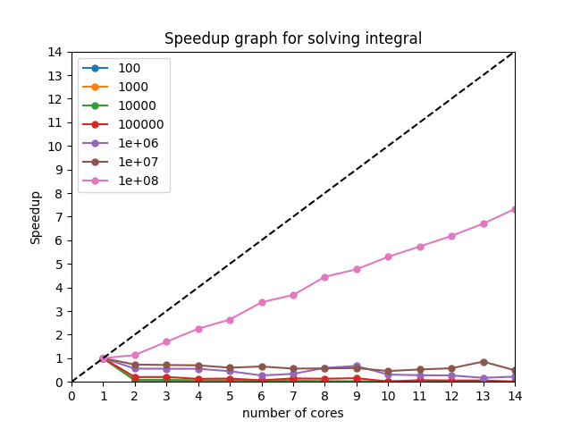

## Calculate integral using parallel programming
This program calculates the integral of $$ \(\int_{0}^{1} \dfrac{4}{1+x^2} \,dx\) $$
with as the amount of processors provided.
### Compile and run
* Linux:  
  1. Run the following``module add centos/8/mpi/hpcx-v2.7.0``
  2. and now run multiple commands in ``c.txt`` using the following:  
  ``mpiCC main.cpp && . ./c.txt``

* Windows
  1. Compile the code using visual studio
  2. Go to `Debug` directory
  3. Run the `.exe` file using `mpiexec -n 4 file_name.exe`
     1. You can also run multiple commands using `c.bat` file

### Program output

* You can upload your new results of running in `/Graphing/Inputs` 
with the special naming which is created by the `main.c` file and 
get the new graph for your file using `graph.py`